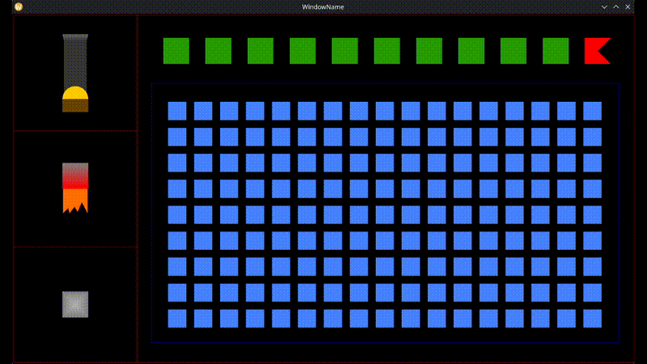
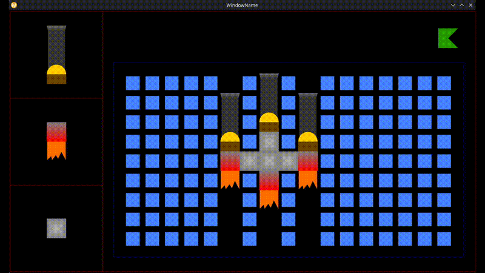

# Chicken Invaders — with a Ship Editor

A simplified Chicken Invaders clone written in C++ on top of the [gfx-framework](https://github.com/UPB-Graphics/gfx-framework) OpenGL teaching framework. Before the game starts, you build your own ship in an editor.

---

## Ship Editor



The editor opens on a 17 × 9 grid. A palette on the left lets you pick one of three block types to place.

| Block | Icon color | Effect in-game |
|---|---|---|
| Building block | grey | +1 life |
| Thruster | red and orange | +1 movement speed |
| Cannon | brown yellow and dark gray | +1 projectile per shoot |

Left-click a cell to place the selected block type; right-click a placed block to remove it. Two constraints apply before you can press Play:

- The total block count must be 10 or fewer.
- All placed blocks must form a single contiguous group (no isolated pieces).

A full building-block ship gives you 10 lives but only one slow projectile per shot. A cannon-heavy ship fires wide salvos but has few hit points. Thrusters trade both for speed.

---

## Gameplay



After pressing Play, your ship appears at the bottom of the screen.

### Controls

| Input | Action |
|---|---|
| `←` `→` `↑` `↓` | Move ship |
| `Space` | Fire all cannons |

### Objective

There are 3 waves of chickens. Each wave the chickens march across the screen and periodically drop eggs downward. Clear all chickens in a wave to move to the next. Clear all three waves to win.

- Eggs that reach your ship remove one life.
- Cannon projectiles destroy chickens and eggs on contact, adding 10 points per kill.

### Losing condition

Your starting number of lives equals the number of building blocks in your ship. Reach 0 lives and the game shows a Game Over screen.

### HUD

The UI shows health (one heart per remaining life), current score, and speed tier (number of thrusters).

---

## Project Structure

```
src/lab_m1/tema1/
├── Tema1.cpp / .h          # Main scene: game loop, rendering, state machine
├── PlayerShip.cpp / .h     # Ship model (blocks, stats, hitbox)
├── Chicken.cpp / .h        # Chicken enemy: movement, wave behaviour
├── Projectile.cpp / .h     # Shared projectile base
├── CannonProjectile.h      # Player projectile
├── ChickenProjectile.h     # Egg projectile
├── EditBlockData.cpp / .h  # Editor grid cell data
├── InteractableMesh.cpp/.h # Clickable mesh wrapper (editor palette buttons)
├── objects2D.cpp / .h      # Procedural 2-D shape geometry
├── Transformations.h       # 2-D transformation matrix helpers
└── constants.h             # Tuning constants (grid size, speeds, radii, …)
```

---

## Building

Requires CMake and a C++17 compiler. The `Tema1` scene is registered in [`src/lab_m1/lab_list.h`](src/lab_m1/lab_list.h).

```bash
mkdir build
cd build
cmake ..
cmake --build .
./bin/Debug/GFXFramework
```

---

## Dependencies

All dependencies are vendored under `deps/`:

- OpenGL via GLFW + GLAD
- GLM — mathematics
- FreeType — HUD text rendering
- Assimp, stb — asset loading
